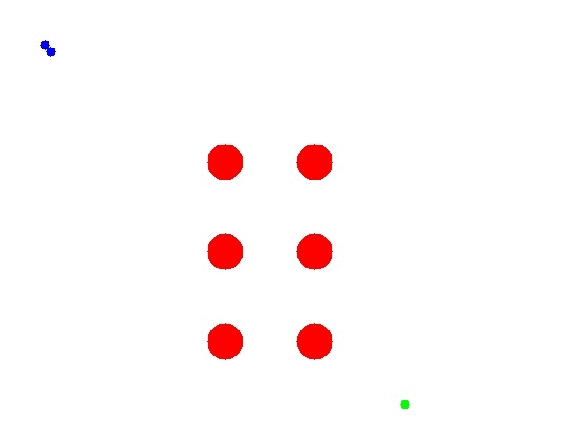
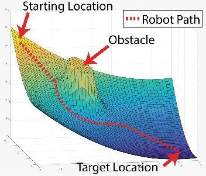

# Artificial Potential Field for path planning

### Algorithm in action:

- Blue => Agent trajectory
- Red => Obstacle
- Green => Goal

### What is artificial potential field?

At each instance the surrounding (reachable) coordinates are evaluated using a cost function. The cost function calculates the attraction/repulsion force of all the objects in the scenes (repulsion for obstacles and attraction for goal) and assigns a score value to each cell.
This algorithm does not garauntee optimal shortest path as it follows local gradients. We can use random particles with pobablistic cell selection to get better results (computationally expensive but sometimes may give optimal results).